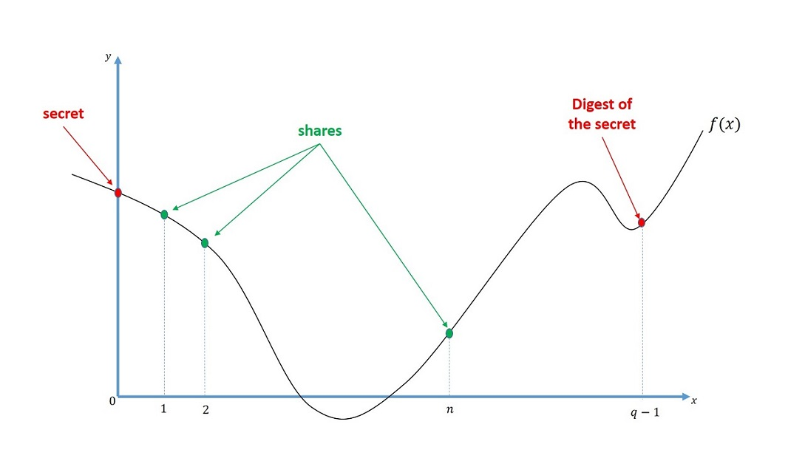
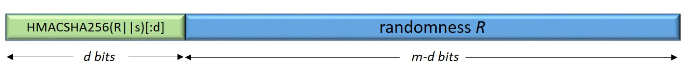
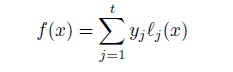
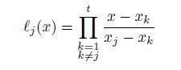

# Reference implementation for Mnemonics Research Project

## Table of contents
  * [Description](#description)
  * [Notation](#notation)
  * [Shamir's secret sharing scheme (SSS)](#shamir-secret-sharing-scheme)
  * [Generating shares and reconstruction of the secret](#generating-shares-and-reconstruction-of-the-secret)
  * [Format of a share](#format-of-a-share)
  * [Basic Usage](#basic-usage)
  * [Design rationale](#design-rationale)
  * [References](#references)

## Description
In this project we implement a modified version of Shamir’s secret sharing scheme (SSS) in order to share a secret phrase, called mnemonics, in a secure way. 

## Notation

| Symbol | Descripton |
| --- | --- |
| n	| Number of shares |
| t	| Threshold |
| s	| Secret |
| D	| Digest of the secret |
| nb	| Number of bits, nb = log<sub>2</sub> len(dictionary)|
| nw	| Number of words in the mnemonic |
| q	| Order of the Galois field, q = nb * nw |
| F	| Galois field, F = GF(q)|
| m	| Size of q in bits, m = log<sub>2</sub> q |
| d	| Number of bits taken from the hash of the secret, the first part of the digest D. |
| R	| Number of bits of the randomness which is the remaining part of the digest D. |

## Shamir secret sharing scheme

Let F be a finite field with q elements. A (t, n)-threshold secret sharing scheme shares a non-zero secret s among n users such that any t or more shares can reconstruct the secret but t-1 or less cannot. Shamir's secret sharing scheme is an ideal and perfect (t, n)-thresholds scheme and can be defined in two phases as follows:

### 1. Share Generation Phase:

+ A dealer chooses a secret polynomial f(x) with degree t-1, such that its constant term is the secret to be shared s.

+ The dealer sends the tuple (x<sub>i</sub>, f(x<sub>i</sub>)) as the share to i-th user, where x<sub>i</sub>'s are all non-zero and distinct for i = 1, … , n.

### 2. Reconstruction Phase: 

+ If any t or more users jointly perform a Lagrange interpolation with their shares, they obtain the secret polynomial f(x), and f(0) yields the secret s.

In addition to the above definition, we also encode the digest of the secret as f(q-1) as stated in SLIP-0039: Shamir's Secret-Sharing for Mnemonic Codes. Let s the secret to be shared and D be it's digest such that, D = HMAC-SHA256(R || s)[:d] || R, where R is the randomness with length m-d in bits, for m = log<sub>2</sub> q and some integer d. 



In other words the digest share D is composed of two parts; first d-bit part is the first d bits of the output of the hash function and the remaining part is a randomness with m-d bit length. Assume that we encode our secret as s = f(0) and the digest D = f(q-1).


 
Our scheme takes a secret mnemonic as string, converts it to binary string and performs padding if needed. Then it is converted to integer. Then after generating the integer shares, all the shares are converted into string and parsed as distinct n mnemonics. Below we describe only the share generation and secret reconstruction phases. 

## Generating shares and reconstruction of the secret

### Polynomial interpolation
Lagrange interpolation formula tells us that constructing a degree t-1 polynomial requires at least t points. Assume that we have t distinct points (x<sub>1</sub>,y<sub>1</sub>), (x<sub>2</sub>, y<sub>2</sub>), … , (x<sub>t</sub>, y<sub>t</sub>). Then we can construct the unique degree t-1 polynomial as follows: 


 
where l<sub>l</sub>(x) is the Lagrange basis polynomial with respect to the j-th point, i.e.



### Share Generation

#### INPUT: secret, total number of shares n, threshold t, order of Galois field q, irreducible polynomial of GF(q) 

#### OUTPUT: list of n shares

+ Encode s = f(0) and the digest D = f(q-1).
+ Pick random t-2 more points, i.e. (x<sub>1</sub>, y<sub>1</sub>), (x<sub>2</sub>, y<sub>2</sub>), … , (x<sub>t-2</sub>, y<sub>t-2</sub>).
+ Using the shares (0, s), (q-1, D), (x<sub>1</sub>, y<sub>1</sub>), (x<sub>2</sub>, y<sub>2</sub>), … , (x<sub>t-2</sub>, y<sub>t-2</sub>), perform Lagrange interpolation and construct the unique degree t-1 polynomial f(x).
+ Generate n-t+2 more shares by evaluating f(x) at the points x<sub>t-1</sub>, … , x<sub>n</sub>. 
+ Output n shares (x<sub>i</sub>, y<sub>i</sub>) for i = 1, … , n.

### Secret Reconstruction
#### INPUT: list of share id x, list of access shares y, order of Galois field q, irreducible polynomial of GF(q), digest length.
#### OUTPUT: secret or abort.
+ Apply Lagrange interpolation fort he shares (x<sub>j</sub> , y<sub>j</sub>) for j = i<sub>1</sub>, … , i<sub>t</sub>, and recover the secret polynomial f(x).
+ Compute the secret s' = f(0)
+ Compute the digest D' = f(-1)
+ If HMAC-SHA256(D'[d:] || s')[:d] = D'[:d], then return s'. Otherwise abort.

## Format of a share

Our shares are stored in json files which are created in the same location with **create_shares.py**.  The shares include the following information:

 ```Python
  {
    "id": i,
    "share": [
        "word1",
        "word2",
        "word3",
        .
        .
        .
        "word_(nw)"
    ]
}
 ```
## Basic usage
One can share his secret by running below command in the terminal.

```Python
  Python3 -n #shares -t #threshold -s path/secret.txt
 ```

If the secret file is not defined than it is typed on the terminal. The **reconstruct.py** takes json files automatically from the same location and outputs the secret s if the number of the shares is enough.

## Design rationale

### Role of the digest
+ The digest is encoded as a point in our scheme. It is the evaluation of the polynomial f(x) at q-1, e.i. f(q-1). Using digest provides us an additional check before returning the reconstructed secret with probability 1/d. 
+ On the other hand it decreases the entropy from 2<sup>m</sup> to 2<sup>m-d</sup> (for further information please see security analysis). 

### Number of words and Galois field
Number of words nw and the number of bits nb which is the size of the dictionary from which the words are picked determines the size of our Galois field. We have the primitive polynomials of degree up to 660. Therefore, for a dictionary of size 2048, e.i. nb = 11, our scheme supports up to 60 word secrets. 

### Security
  + Although Shamir’s secret sharing scheme (SSS) is information theoretically secure, there is a known active adversary attack against it. Assume an adversary who interacts with t-1 shareholders and perform share reconstruction with a faulty share. If she can do this again with another t-1 shareholders (1 different shareholder suffices), she can construct the secret without knowing nothing about the secret. In order to avoid such an attack we plan to take some security measures which force the active adversaries to behave passively. We are going to use a composition of authentication schemes and a ZK proofs for the reconstruction process.
  + Another security issue for our modified scheme is the decreasing entropy because of the digest check that is used in the reconstruction phase. But ensuring that m-d < 128 can defeat this low entropy weakness. 
  + Finally we have another issue for the security. Assume that an attacker has k shares such that t < k < n, and assume that e shares among k are faulty shares. In this case Lagrange interpolation does not work because of the faulty shares. But if e < t < k/3 then Berlekamp-Welch algorithm works and the adversary can reconstruct the secret without knowing the true shares.

### References
  1. Shamir, A.: How to share a secret. Communications of the Association for Computing Machinery 22(11), 612_613 (Nov 1979)
	
  2. BIP-39: Mnemonic code for generating deterministic keys
	
  3. SLIP-0039: Shamir's Secret-Sharing for Mnemonic Codes

